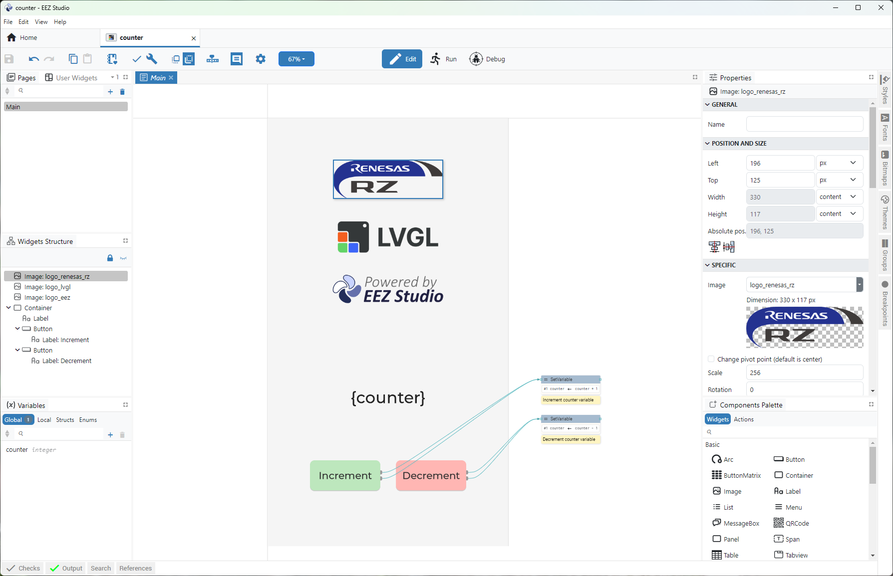
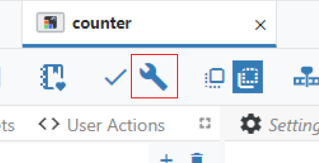

# EEZ Studio example with Renesas EK-RZ/A3M and LVGL


Integration steps:

- Open `counter.eez-project` in the [EEZ Studio](https://github.com/eez-open/studio/releases)



- Build the project source code files:



Source code files are generated inside `src/ui` folder.

- Add `ui_init()` and `ui_tick()` in `src/LVGL_thread_entry.c`

```
#include "ui/ui.h" // Add this!

// ...

void LVGL_thread_entry(void *pvParameters)
{
    // ...

    lv_init();
    
    lv_port_disp_init();

    lv_port_indev_init();

    ui_init(); // Add this!

    // ...
    // Comment out LVGL demo
    // ...

    while (1)
    {
        uint32_t time_till_next = lv_timer_handler();

        ui_tick(); // Add this!

        vTaskDelay (pdMS_TO_TICKS(time_till_next));
    }
}
```


# LVGL ported to Renesas EK-RZ/A3M

1. Project Overview:
    
    This project demonstrates LVGL (Lightweight Versatile Graphics Library) running on the EK-RZ/A3M.

2. Hardware Requirements:
    - EK-RZ/A3M
    - MIPI Graphics Expansion Board

3. Hardware settings:
    
    - Boot Mode: Boot mode 4 (3.3-V Single or Quad serial NOR flash memory)
    - Board: EK-RZ/A3M NOR Boot (Exec with DDR SDRAM)

4. Hardware Connection:

    1. Set for DIP switches and jumpers as follow.
 
        ```    
        - SW5-1 : OFF 
          SW5-2 : OFF
          SW5-3 : OFF
          SW5-4 : OFF
          SW5-5 : OFF
        - SW4-1 : OFF 
          SW4-2 : OFF
          SW4-3 : OFF
          SW4-4 : OFF
          SW4-5 : OFF
        - J9    : Jumper connects 2-3
        ```

    2. Connect J1 of MIPI Graphics Expansion Board to J32 on EK-RZ/A3M.
    3. Connect the EK-RZ/A3M and PC with USB type C cable through port DEBUG1.
